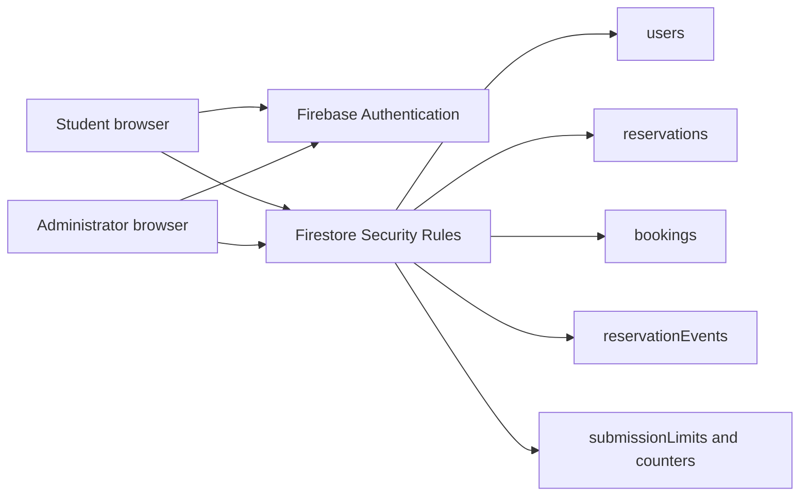
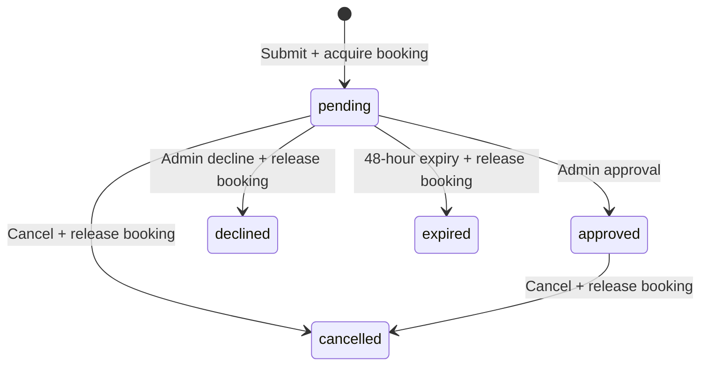

# Facility reservation architecture



The static website uses Firebase Authentication and Firestore. It has no running Cloud Functions or file uploads. Browser validation improves usability; Security Rules enforce authorization and database consistency. Trusted local maintenance scripts use the Admin SDK and therefore bypass Security Rules.

## Roles

| Operation | Student | Administrator |
|---|---|---|
| Read reservation | Own records | All records |
| Submit | Verified Gmail + approved enrollment, max 5/day | Max 5/day |
| Approve/decline | Denied | Pending records only |
| Cancel | Own pending/approved record before start | Pending/approved records |
| Permanently delete | Denied | Denied |
| Update venue | Denied | Allowed |
| Upload PDF | Denied | Denied |

## State transitions



Every decision and cancellation creates an immutable audit entry in the same transaction. Closed requests cannot be reopened. Different venues may share the same date and slot. The same venue/date/slot has only one booking document, so concurrent transactions cannot acquire it twice.

## Limits and operations

- Students register using gmail.com and verify email before submitting. This does not prove enrollment.
- Dates are valid Manila calendar dates within the next 90 days.
- A per-user Manila-day document enforces five submissions; cancellation does not reset the quota.
- Numeric references range from 1 to 99999 and are never reused. UUIDs remain internal relationships.
- Pending holds expire after 48 hours and can be replaced without an administrator online. Admin pages later reconcile stored expired status and audit entries.
- Admin pages and student lists subscribe to live reservation changes. Request/history lists use database cursor pagination with 25 rows per page and global aggregate counts.
- The exposed service-account key was rotated and revoked on 2026-10-06. Never commit the replacement private key.

## Verification

Install test dependencies with `npm install --prefix tools`.

Run unit tests with `node --test tests/*.test.cjs`.
Run actual Security Rules tests using Firebase CLI, Java 21, Firebase JS SDK and `@firebase/rules-unit-testing`:

```
NODE_PATH=./tools/node_modules npx firebase-tools emulators:exec --config firebase.test.json --project demo-frms-rules --only firestore,auth "node --test tests/firestore-rules.integration.cjs"
```

The demo project and local emulator prevent changes to production data. Tests cover verified submissions, student isolation, forbidden approval, cancellation, venue-specific conflicts, forged fields and disabled PDFs.
